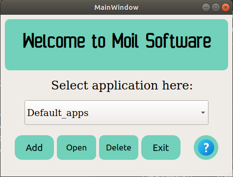

## Moildev Application using Plugins

*Date: 13/05/2021*

*Modification: Heru Syah Putra*


1. **Introduction**

   A plugin is a software component that adds a specific feature to an existing computer program. When a program supports plug-ins, it enables customization. 

   There are many benefits to building apps with a plugin framework:

   - 3rd party developers can create and extend upon your app
   - new features are easier to develop
   - your application becomes smaller and easier to understand

2. **How to use this apps**

   Before you install the Moildeb app, you have to install Qt5 for the platform plugin, follow the steps for this installer
      ```
      $ sudo apt-get install build-essential
      $ sudo apt-get install qtcreator
      $ sudo apt-get install qt5-default
      ```
   make sure you has install python3 then follow the step bellow.
   - clone this repository
      ```
      $ git clone git clone https://github.com/MoilOrg/MoilApps-Plugins.git
      ```
   - change directory to the repository folder

     ```
     $ cd MoilApps-Plugins
     ```
     
   - To run this program, we recommend that you create an environment by following the steps below:
     ```
     $ sudo apt install virtualenv
     $ virtualenv env
     $ source env/bin/activate
     ```

   - install the requirements below in the environment you created earlier

     ```
     $ pip install Moildev==2.1.0
     $ pip install Pillow==8.0.1
     $ pip install PyQt5==5.15.0
     ```
     
   - change directory to the repository folder

     ```
     $ cd src
     ```
     
   - run the main_apps.py in folder "src"
     ```
     $ python main_apps.py
     ```

After you run this program, a display will appear as shown below.

   

   The example application is stored in folder "list_application", you can add, open, and delete.

3. For more documentation, **coming soon....**

